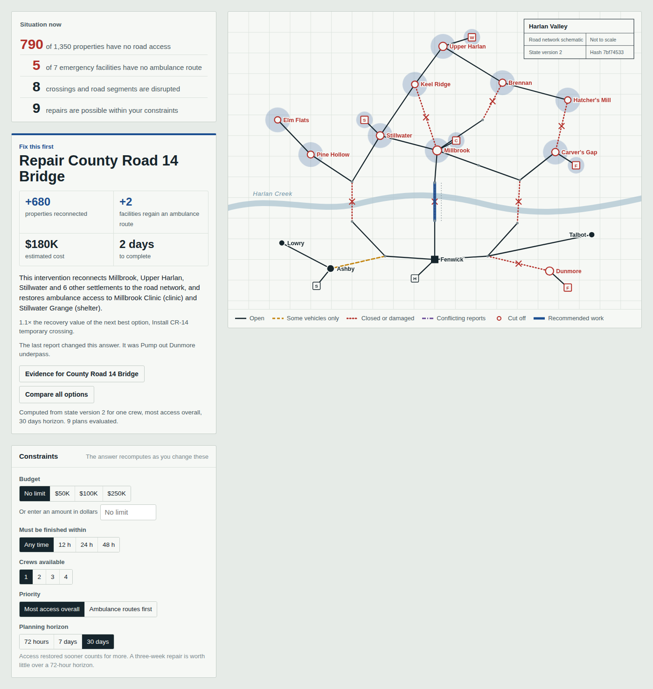
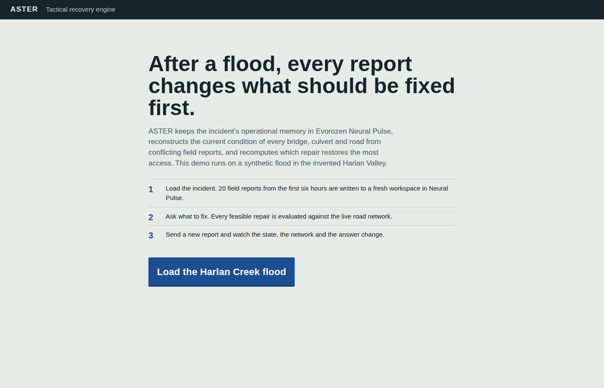
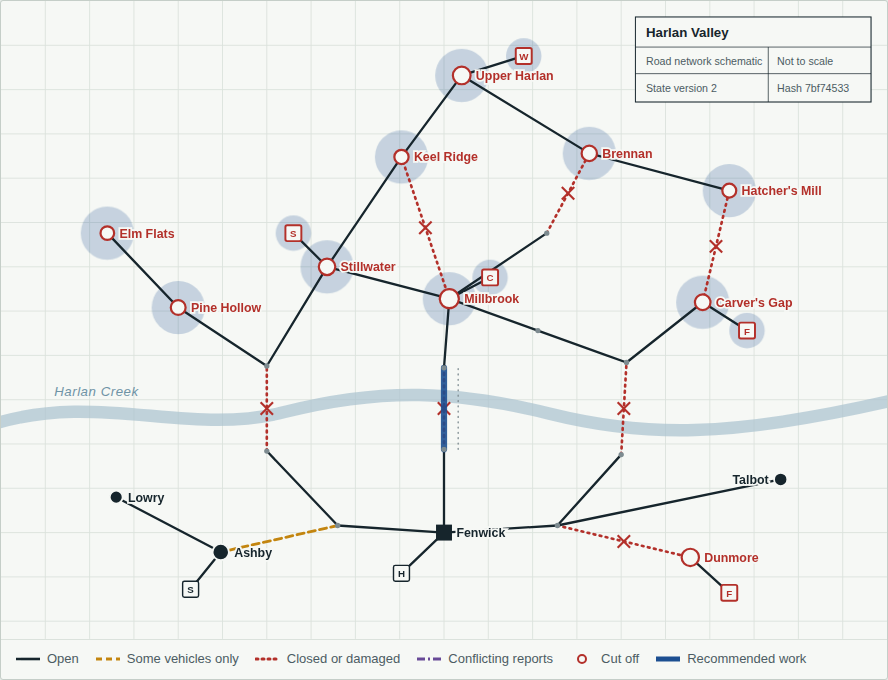
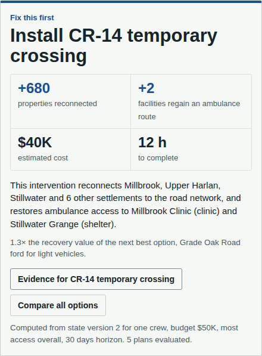
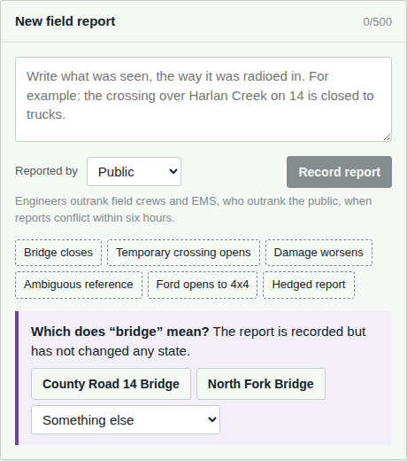
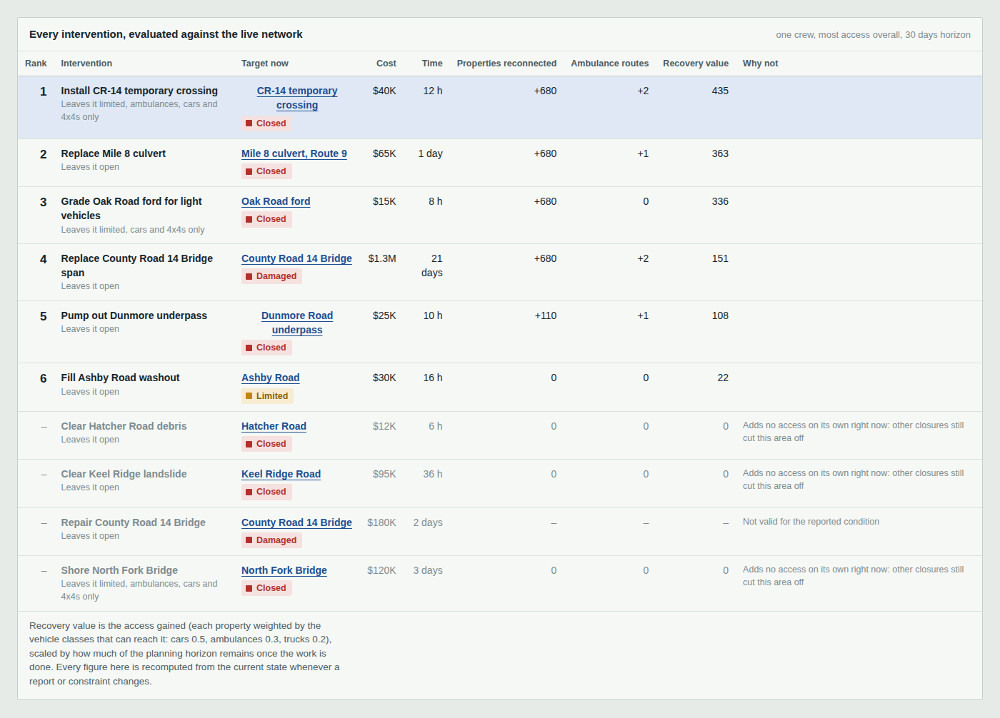
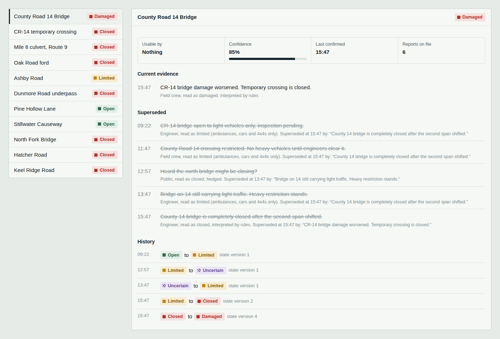

# ASTER

> **Built for the Evorozen Apex: NextGen AI Buildathon 2026** · Track: **Climate & Resource Optimization** · Powered by **Evorozen Neural Pulse**
>
> MIT licensed · Repository: https://github.com/Abdullah49645/aster

**What should we fix first?** After a flood, every field report changes the answer. ASTER keeps the incident's operational memory in Evorozen Neural Pulse, reconstructs the current condition of every bridge, culvert and road from messy and conflicting reports, and recomputes which repair restores the most access, with the consequences computed on a real road network rather than guessed.

> The demo region, Harlan Valley, and its flood are **synthetic**. Place names, roads, property counts, costs and durations are invented inputs. Every figure the app displays is computed from those inputs by the engine.



---

## The problem

In the first days of a flood, an emergency operations centre is flooded with reports: "CR-14 bridge open to light vehicles", then "no heavy vehicles", then a caller who "heard the north bridge might be closing?", then an engineer saying the span shifted. Each report may contradict, refine or repeat an earlier one. They refer to the same structure by different names. Some are hedged.

The decision the room actually has to make is narrow and urgent: with the crews, money and hours available, which repair restores the most access, and does that answer still hold after the latest report? Today that is done on whiteboards and memory. Two things go wrong:

1. **State drifts.** Nobody can say with confidence what the current condition of each crossing is, or which report that belief rests on.
2. **Consequences are guessed.** "Fix the bridge" feels right, but whether it beats a 12-hour temporary crossing depends on network topology, what else is closed, the budget, and how long each option takes.

## What ASTER does

```
field report ─▶ interpret ─▶ resolve entity ─▶ append to ledger ─▶ fold state ─▶ network engine ─▶ optimizer ─▶ recommendation
                (Pulse chat)  (Pulse vector_search)  (Pulse)          (deterministic)  (deterministic)  (exact)
```

- **Overview.** The situation in four numbers, one button ("What should we fix?"), and an answer: the intervention, properties reconnected, facilities that regain an ambulance route, cost, duration, why, how it compares with the next option, and whether it survives unresolved conflicts. Changing budget, time window, crews, priority or planning horizon recomputes the answer instantly.
- **Live state.** Type a report the way it would be radioed in. Watch it travel through every stage, with each Neural Pulse call, its status and timing listed. Ambiguous references wait for a person to choose, and that choice is saved to Pulse memory as a learned alias.
- **Interventions.** Every intervention evaluated against the live network, ranked, with the reason each excluded option was excluded. With more than one crew, the best combinations, found by exact enumeration.
- **Evidence.** For each piece of infrastructure: current status, confidence, when it was last confirmed, the reports it rests on, the reports that were superseded (and by what), conflicting alternatives, and its full history.

## Screenshots

All screenshots are captured from the running app on the synthetic Harlan Creek flood incident.

**Start screen.** Each visitor gets their own copy of the incident, written to Neural Pulse.



**The network sheet after "County 14 bridge is completely closed."** Hollow red settlements are cut off from the county seat. Red crossed links are closed, amber dashed links carry only some vehicles, and the recommended repair is drawn in blue with the settlements it reconnects highlighted.



**Constraints change the answer.** With a $50K budget the engine recomputes and recommends the $40K, 12-hour temporary crossing instead.



**Ambiguous reports wait for a person.** "The bridge is shut." could mean two bridges. The report is recorded but changes nothing until someone chooses; the choice is saved to Neural Pulse as a learned alias.



**Every intervention, evaluated against the live network.** After the bridge is reported damaged, the standard repair is out of scope and the three-week replacement ranks fourth on recovery value.



**Evidence.** Every status traces back to the reports it rests on, the reports it superseded, and its full history.



## Why Neural Pulse, specifically

Neural Pulse is used as the operational memory of the incident, not as a decorative API call. Concretely:

| Role | Pulse feature | What breaks without it |
|---|---|---|
| System of record for the incident | `create_schema`, `bulk_insert`, `insert_data`, `select_data` on five tables | Nothing persists between requests; the app is stateless on Vercel by design |
| Append-only evidence ledger | `aster_observations` (one row per claim, never deleted, `superseded_by` set on update) | No audit trail; the Evidence view and every "why" disappear |
| Materialized current state | `upsert_data` on `aster_entity_state` keyed by `incident:entity` | State must be refolded from scratch on every read; no drift detection |
| Semantic entity resolution | `vector_search` over `aster_aliases` | "The crossing over Harlan Creek on 14" cannot be matched to `CR14-BRIDGE` |
| Memory that learns | `insert_data` of learned aliases after a person resolves an ambiguous mention | Every future report using that phrasing needs a person again |
| Report interpretation | `chat` action, strict JSON validated with zod | Falls back to the deterministic rules interpreter (labelled as such) |
| State history | `aster_transitions` | No timeline, no "what changed and why" |

**Being honest about the boundary.** Neural Pulse does not (as documented) do entity resolution with confidence thresholds, temporal supersession, or conflict handling. ASTER does not pretend it does. Pulse holds the memory and does the semantic retrieval; the rules that turn a ledger into current state are ASTER's own deterministic fold (`src/engine/world.ts`), so every status can be traced to specific observations and re-derived. On every load, ASTER re-folds the Pulse ledger and compares it with the materialized state in Pulse; any disagreement is reported as drift.

## How it decides

### State reconstruction (`src/engine/world.ts`)

Reports are applied in time order. Sources are ranked: engineer (3) > EMS = field crew (2) > public (1).

1. A firm report supersedes earlier evidence it disagrees with. Agreeing evidence is kept as support and raises confidence.
2. A report that contradicts the current one **about which vehicles can use the link**, from a less reliable source within six hours, does not win. The link becomes **Uncertain**, with both readings kept.
3. A hedged report ("may be unsafe") never supersedes anything. If it disagrees, the link becomes Uncertain.
4. Damage is sticky. "Closed" after "Damaged" supports the damage assessment instead of erasing it; only a report that the link is passable clears it. An escalation (Closed to Damaged) is not a contradiction.
5. A provisional link (the temporary crossing) is closed until someone reports it in service.
6. Nothing is deleted. Superseded reports stay in the ledger, pointing at what superseded them.

Uncertain links are treated as closed by the network engine (the conservative choice), and the optimizer then checks whether its recommendation would change if each uncertain link is actually passable.

### Network engine (`src/engine/network.ts`)

A road graph of 31 nodes and 36 links, with 11 pieces of disruptable infrastructure and 10 costed interventions. Each link carries the vehicle classes it supports (ambulances, cars and 4x4s, trucks); each infrastructure entity restricts the links it governs. Reachability from the county seat is computed per vehicle class by breadth-first search. From that come: properties with no road access, facilities with no ambulance route, disrupted links, and connected components.

Access score = Σ properties × weights of the vehicle classes that can reach them (cars 0.5, ambulances 0.3, trucks 0.2). The weights are explicit inputs, not learned.

### Optimizer (`src/engine/optimizer.ts`)

Interventions are few, so ASTER enumerates **every** feasible combination up to the number of crews (1 to 4) and evaluates each with the full network engine. This is the true optimum, not a greedy ranking, and it captures synergy (two repairs in series) and redundancy (two repairs reconnecting the same area).

- **Recovery value** = access gained × (horizon − duration) / horizon. Access restored sooner counts for more; a three-week replacement is worth little over a 72-hour horizon.
- **Feasibility:** budget, time window, crew count, and scope. Each intervention declares the conditions it is valid for (a $180K repair scoped for a limited or closed bridge is not a valid plan once the bridge is reported damaged).
- **Determinism:** fixed enumeration order and a fully specified tie-break (value, then raw access, then cost, then duration, then id). Same state and constraints give byte-identical results; the state hash is shown on the network sheet.
- Plans containing an intervention that adds nothing on top of the others are pruned as dominated.

## End-to-end example (numbers from the engine)

All figures below come from running the engine on the seeded incident. They are asserted in `tests/engine.test.ts` and `tests/pipeline.test.ts`.

| Step | State | ASTER recommends |
|---|---|---|
| Incident loaded (20 seeded reports) | 110 of 1,350 properties cut off; CR-14 bridge limited to ambulances and cars | Pump out Dunmore underpass: +110 properties, +1 facility with an ambulance route, $25K, 10 h |
| Engineer: "County 14 bridge is completely closed after the second span shifted." | 790 of 1,350 cut off; 5 of 7 facilities with no ambulance route | **Repair County Road 14 Bridge**: +680 properties, +2 facilities, $180K, 2 days |
| Budget set to $50K | same | Install CR-14 temporary crossing: +680 properties, +2 facilities, $40K, 12 h |
| "Temporary crossing is now usable by emergency vehicles." | ambulances reach the north valley; cars still cannot | Repair County Road 14 Bridge |
| "CR-14 bridge damage worsened. Temporary crossing is closed." | Bridge **Damaged**; the standard repair is now out of scope | Install CR-14 temporary crossing. The $1.25M, 21-day replacement ranks 4th on recovery value |
| 3 crews, $150K budget (after the closure) | same as step 2 | Temporary crossing + Mile 8 culvert + Dunmore pumps: $130K, 24 h, **0 properties cut off**, +4 facilities |
| "The bridge is shut." (public) | recorded, no state change | Waits for a person: County Road 14 Bridge or North Fork Bridge |

## Architecture

```mermaid
flowchart LR
  UI[Next.js client<br/>Overview, Live state,<br/>Interventions, Evidence] -- report --> API[/api/observations]
  API --> I[interpret<br/>Pulse chat or rules]
  I --> R[resolve<br/>Pulse vector_search]
  R --> L[(Pulse ledger<br/>aster_observations)]
  L --> F[deterministic fold]
  F --> S[(Pulse state<br/>aster_entity_state<br/>aster_transitions)]
  S --> UI
  UI --> E[engine in the browser<br/>network + optimizer + explain]
```

The engine (`src/engine`) is pure TypeScript with no I/O. It runs on the server (to report "recommendation before and after" in each pipeline trace) and in the browser (so constraint changes recompute instantly without a network round trip). Both use the same code.

```
app/                 Next.js App Router: page, layout, API routes
  api/state          GET   current incident snapshot (live from Pulse, or labelled cached fallback)
  api/incidents      POST  create a fresh demo incident for this visitor in Pulse
  api/observations   POST  submit a report through the full pipeline
  api/observations/resolve  POST  a person resolves an ambiguous mention
  api/setup          POST  register tables and seed aliases (admin token)
  api/health         GET   Pulse reachability
src/engine/          world model fold, network, scenarios, optimizer, explanations (pure)
src/pulse/           Pulse client, table schema and codecs, interpretation, resolution, store/pipeline
src/server/          validation, rate limiting, incident cookie
src/data/            Harlan Valley region, seeded incident, sample reports (synthetic)
src/ui/              React client components
scripts/             pulse-probe (live contract check), setup-pulse
tests/               engine and pipeline tests; tests/fake-pulse.ts is a TEST-ONLY contract fake
```

## Neural Pulse integration details

- One endpoint: `POST https://pulse.evorozen.com/api/neural`, `Authorization: Bearer <key>`, body `{ action_type, prompt, data_payload? }`. The keys never leave the server.
- The ledger is append-only in practice: ASTER never edits existing observation rows. The live service was observed returning duplicated and altered copies of rows after updates, so every read de-duplicates by primary key, seeded rows are rebuilt from ASTER's own definition, supersession is re-derived by the fold, and a person's resolution is stored as a new override row.
- The live API requires `filter` and `changes` for `update_data` (the OpenAPI spec says `updates`, which the live service rejects).
- The live API requires a non-empty `prompt` on **every** request, including data actions (the OpenAPI spec marks it optional; the live service returns 400 without it). Data actions send a literal one-line description of the operation.
- Where the docs page and the OpenAPI spec disagree (`where`/`changes` vs `filter`/`updates`), ASTER follows the OpenAPI spec and SDK in [evorozen-sdk](https://github.com/Raza-Abbas32/evorozen-sdk). `npm run pulse:probe` checks both against the live API.
- Client (`src/pulse/client.ts`): 15 s timeout, one retry on network errors, timeouts and 5xx (never on usage-limit errors), and a hook that records every call (action, HTTP status, milliseconds, `traceId`) for the visible pipeline trace.
- Tables (prefix from `PULSE_TABLE_PREFIX`, default `aster_`): `incidents`, `aliases`, `observations`, `entity_state`, `transitions`. Each visitor gets their own incident id (cookie), so judges and visitors do not overwrite each other.
- Entity resolution: when Pulse returns similarity scores, auto-resolve if the best entity scores at least 0.55 and leads the next by at least 0.06. When Pulse returns only a ranking, auto-resolve only if the top two hits are the same entity. Otherwise the report waits for a person. If `vector_search` fails, Pulse full-text `search` is tried. ASTER never guesses.
- Mentions are reduced to their reference phrase before resolution ("County 14 bridge is completely closed after…" becomes "County 14 bridge"), so status words do not dilute similarity.
- Failure handling: if Pulse is unreachable or unconfigured, the app shows the seeded state computed locally, clearly labelled **Cached demo state**, and pauses report submission. It never invents a Pulse response. Failed writes return an error and change nothing.

## Run it locally

**Requirements:** Node.js 20.9 or newer (22 LTS recommended) and at least one Evorozen Neural Pulse API key from https://pulse.evorozen.com.

**1. Get the code and install**

```bash
git clone https://github.com/Abdullah49645/aster.git
cd aster
npm install --include=dev
```

**2. Create your settings file**

```bash
cp .env.example .env.local          # macOS / Linux
copy .env.example .env.local        # Windows
```

Open `.env.local` (macOS: `open -e .env.local`) and set:

```
EVOROZEN_API_KEYS=evo_live_key1,evo_live_key2
EVOROZEN_PROBE_KEY=evo_live_key3
ASTER_ADMIN_TOKEN=any-random-string-of-16-plus-characters
```

- `EVOROZEN_API_KEYS`: one key, or several separated by commas with no spaces or quotes.
- `EVOROZEN_PROBE_KEY`: optional spare key used only by the contract check in step 3.
- `ASTER_ADMIN_TOKEN`: letters, numbers and dashes, at least 16 characters.

**3. Optional: check the live API contract (about 20 calls)**

```bash
npm run pulse:probe
```

Prints PASS/FAIL per Neural Pulse action and writes `scripts/pulse-probe-report.json`.

**4. Create ASTER's tables on every key (once, safe to repeat)**

```bash
npm run pulse:setup
```

Expect "Created: aster_incidents, …" and "Aliases seeded: 39" for each key.

**5. Start the app**

```bash
npm run dev
```

Open http://localhost:3000.

**6. Run the demo**

1. Click **Load the Harlan Creek flood**, then **What should we fix?**
2. Open **Live state** and record the sample reports in order: **Bridge closes**, **Temporary crossing opens**, **Damage worsens**, **Ambiguous reference**. Watch the pipeline trace on the right and the answer on Overview change.
3. On Overview, try the **$50K** budget and **3 crews**.
4. If a key reaches its limit, press **Reset demo** to continue on the next key.

Without any key the app still runs, showing the clearly labelled cached state.

**Troubleshooting**

| Symptom | Fix |
|---|---|
| `tsx: command not found` | `npm install --include=dev` (your npm is skipping dev dependencies) |
| `copy: command not found` on macOS | use `cp` |
| Error mentioning esbuild | `npm approve-scripts esbuild`, then retry |
| "Cached demo state" banner | Pulse unreachable or the key is at its limit; check keys, then **Reset demo** |
| Trace says "Interpreted by rules" with a warning | Pulse chat returned unusable output; the app used its deterministic interpreter and says so. Set `ASTER_INTERPRETER=rules` to skip chat |

**Tests** (no key needed):

```bash
npm test          # 55 tests: engine, fold rules, optimizer, key handling, live-contract rules, and the full pipeline
npm run typecheck
npm run build
```

### Call budget and multiple keys

Approximate Neural Pulse calls: setup 4 per key, loading an incident 8, each page load 4, each report 9 to 13, the probe about 20 (add `-- --burst` for an extra 8-call rate-limit test).

`EVOROZEN_API_KEYS` accepts several keys. Each incident's data lives on one key, so a visitor's incident is pinned to the key it was created on (stored in a cookie as an index, never the key itself). New incidents rotate across keys and skip any key that is at its limit or unreachable. If an incident's key runs out, the app says so, shows the labelled cached state, and **Reset demo** starts a fresh incident on the next available key. Limit errors (HTTP 429, 402, or a 403/400 that mentions a limit or quota) are never retried, so they do not burn extra calls.

## Deploy (Vercel)

1. Import the repository in Vercel (framework: Next.js, no build settings needed).
2. Add environment variables: `EVOROZEN_API_KEYS`, `ASTER_ADMIN_TOKEN`, optionally `PULSE_TABLE_PREFIX` and `ASTER_INTERPRETER`.
3. Deploy, then run setup once (it covers every key):
   ```bash
   curl -X POST https://<your-app>.vercel.app/api/setup -H "x-admin-token: $ASTER_ADMIN_TOKEN"
   ```
4. `GET /api/health` should report `"pulse": "reachable"` and the number of keys.

Vercel Analytics is included for anonymous page-view counts.

## Environment variables

| Name | Required | Purpose |
|---|---|---|
| `EVOROZEN_API_KEYS` | yes (for live mode) | One or more Neural Pulse keys, comma separated, server-side only. `EVOROZEN_API_KEY` (single) also works |
| `EVOROZEN_PROBE_KEY` | no | Key used only by `npm run pulse:probe`; defaults to the first key |
| `ASTER_ADMIN_TOKEN` | yes (for setup) | Protects `POST /api/setup`; at least 16 characters |
| `EVOROZEN_BASE_URL` | no | Override the Pulse endpoint |
| `PULSE_TABLE_PREFIX` | no | Table prefix, default `aster_` |
| `ASTER_INTERPRETER` | no | `pulse-chat` (default, falls back to rules) or `rules` (one fewer call per report) |

## Technical decisions

- **Deterministic core, AI at the edges.** Language is messy, so interpretation and entity matching use Pulse. Everything that produces a number the decision depends on is deterministic, explainable and tested.
- **Exact optimization over heuristics.** With under 16 interventions and up to 4 crews there are at most a few thousand combinations; evaluating all of them is fast and removes any question of whether a greedy ranking missed a better plan.
- **Time matters.** Early versions ranked by access alone and recommended a 21-day, $1.25M replacement over a 12-hour temporary crossing. The horizon-weighted recovery value fixes that and is shown to the user as a control.
- **Evidence is never dropped.** Ambiguous and unresolved reports are written to the ledger even though they change no state, so nothing a caller said is lost.
- **Per-visitor incidents.** A shared public demo would let one visitor's reports change another's answer.
- **Rules fallback, always labelled.** If Pulse chat output fails validation, a deterministic interpreter runs instead, and the trace says so. No silent substitution.

## Limitations

- **Synthetic data.** The region, costs and durations are illustrative. A real deployment needs a real road network (for example from OpenStreetMap) and costed intervention catalogues.
- **Unverified live API details.** Built from the published docs and OpenAPI spec. Which column `vector_search` embeds, whether it returns a score, and how reliably `chat` returns JSON are checked by `npm run pulse:probe`; the resolution rule handles both scored and ranked results.
- **The test fake is an approximation.** `tests/fake-pulse.ts` implements the documented contract with token-overlap similarity. It tests ASTER's logic, not Pulse's semantics.
- **Rate limiting is per instance.** It protects the shared Pulse quota from bursts but is not a security boundary.
- **Uniform crews.** Every intervention takes one crew; crew skills and equipment are not modelled.
- **Static costs.** Worsening damage makes a repair out of scope rather than more expensive.

## Future work

- Import real road networks and let planners draw intervention scopes on the map.
- Crew types and sequencing (what to do first, second and third), not only parallel sets.
- Confidence-weighted optimization: expected value across uncertain states instead of a conservative baseline plus robustness check.
- Multi-incident operations with shared learned aliases per region.

## Hackathon

Built for the **Evorozen Apex: NextGen AI Buildathon 2026**, Climate & Resource Optimization track, by [Abdullah49645](https://github.com/Abdullah49645). Neural Pulse is used as the incident's operational memory and semantic retrieval layer, as described above.

## License

MIT License, see [LICENSE](LICENSE). Third-party notices in [NOTICE](NOTICE).
